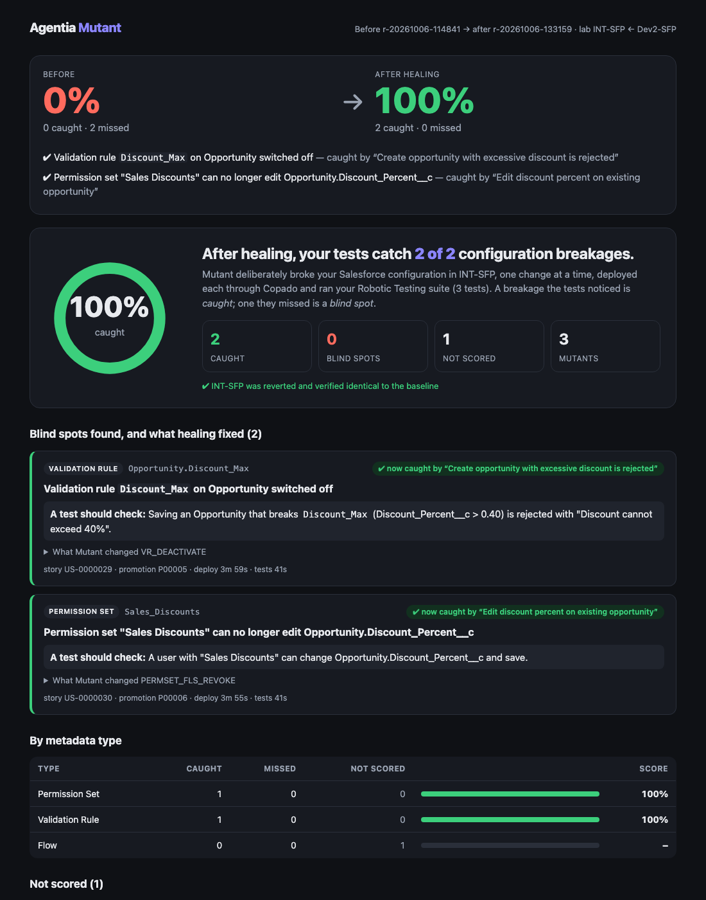

# Agentia Mutant

**Copado runs your tests. Mutant tests your tests.**

Mutant is an [Agentia CLI](https://www.npmjs.com/package/@copado/agentia-cli) plugin that measures how good your tests really are at catching broken **Salesforce configuration**. It deliberately breaks one validation rule, flow, field, permission or layout at a time in a lab environment *through Copado*, runs your Copado Robotic Testing suite, reports which breakages your tests missed, and has Copado AI write the missing tests.



*A real run on a Copado playground: the happy-path suite missed both deployable breakages; the Copado AI Test agent wrote two tests (one fixed in human review); the survivors were re-run and caught. Open [the report](examples/demo/sample-report.html) and [the before/after page](examples/demo/sample-compare.html) — single files, no external resources.*

## Why

Every Salesforce team says "we have tests". Nobody knows whether those tests would fail if a Flow condition flipped, a validation rule was switched off or a permission went missing. Code coverage says nothing about configuration. Teams find out in production.

Mutant applies **mutation testing**, a proven software-engineering technique, to **declarative configuration**:

1. Make one small, realistic breakage (a *mutant*).
2. Deploy it to a lab environment through a Copado promotion.
3. Run the Robotic Testing suite.
4. A test fails → the mutant is **killed** (good). Everything stays green → it **survived** (a blind spot).
5. **Mutation score** = killed ÷ (killed + survived).
6. `mutant heal`: Copado AI proposes tests for the survivors; after human review they are uploaded, the survivors are re-run, and the score goes up.

A finding from our own first run: with edit access to a field revoked, Salesforce still let the test robot *type* into it — it just didn't save the value. The happy-path test never checked the saved value, so the broken permission sailed through. That is exactly the kind of blind spot Mutant exists to expose.

## Try it in 1 minute (no Copado account)

Every Copado call is replayed from a scrubbed recording of the real lab, and the reports use two real, scrubbed runs:

```sh
git clone <this repo> && cd <repo>
npm ci && npm run build
examples/quickstart/run.sh
```

It runs `doctor` (12 checks), `plan` (10 of 15 mutants, time estimate), `report` (the real first run: 0%) and `compare` (after healing: 0% → 100%), and prints the paths of the HTML reports.

## Use it on your pipeline

Requirements: Node ≥ 20, the Agentia CLI with CI/CD, Robotic Testing and AI auth (`agentia setup`), a Source Format pipeline with a **disposable lab environment** that receives promotions from a source environment, a local clone of the pipeline's Git repository, and a Robotic Testing job.

```sh
npm ci && npm run build && agentia plugins link .
agentia mutant init        # lab, source env, pipeline, repo clone, package dir, CRT project/job
agentia mutant doctor      # must be 12/12
agentia mutant plan        # picks mutants and estimates the run; runs nothing
agentia mutant run --plan .mutant/plans/latest.json
agentia mutant report
agentia mutant heal        # Copado AI proposes tests → review them
agentia mutant heal --apply
agentia mutant run --plan .mutant/plans/heal-<run-id>.json
agentia mutant compare <run-id> <new-run-id>
```

During `run`, Mutant prepares one Copado user story per deploy and asks you to create their promotions in Pipeline Manager **in one sitting**; it then runs everything else unattended. See [examples/demo](examples/demo/README.md) for the sample "Discount Approval" app, `seed.sh` and `reset.sh`.

## Commands

| Command | Writes? | What it does |
|---|---|---|
| `agentia mutant init` | local only | Create `.mutant/config.json` (verified against Copado) and install the Agent Skill |
| `agentia mutant doctor` | no | 12 readiness and safety checks, including lab drift against the baseline |
| `agentia mutant plan` | no | Choose mutants (`--story`, `--components`, `--mutants`, `--max`) and estimate the run from measured cycle times |
| `agentia mutant run` | lab only | Baseline → stories → promotions → deploy + test each mutant → revert → verify (`--resume`, `--dry-run`) |
| `agentia mutant report` | no | Score, blind spots with diff and "a test should check", per-type scores; HTML, Markdown, JSON |
| `agentia mutant heal` | no / CRT with `--apply` | Copado AI Test agent writes tests for survivors; you review; `--apply` uploads |
| `agentia mutant compare` | no | Before/after score and report |
| `agentia mutant reset` | lab + CRT | Restore the lab baseline (through Copado) and the test suite |

Every command supports `--json` for agents.

## Mutation operators

11 declarative operators, each a pure, unit-tested function over Source Format XML with a minimal diff: `VR_DEACTIVATE`, `VR_NEGATE`, `FLOW_DECISION_FLIP`, `FLOW_BOUNDARY`, `FLOW_DROP_ASSIGNMENT`, `FIELD_REQUIRED_OFF`, `PICKLIST_DEFAULT`, `CHECKBOX_DEFAULT_FLIP`, `PERMSET_FLS_REVOKE`, `PERMSET_OBJ_REVOKE`, `LAYOUT_FIELD_REMOVE`. Details and example diffs: [docs/operators.md](docs/operators.md).

## Safety

- Writes **only** to the configured `labEnvironment`; refuses names that look like prod/UAT/staging unless `--i-know-this-is-a-lab`.
- **Baseline first:** if the suite is red on the clean lab, nothing is deployed (`--baseline-twice` excludes flaky tests). This also catches broken AI-written tests before they count.
- **Every deploy is safety-checked:** the promotion must be source → lab, forward, and contain exactly the expected story.
- **Always reverts, then verifies** each touched component in the lab against the baseline; on failure it stops and prints exact recovery steps. Ctrl-C stops after the current step and still reverts.
- **Resumable** after a crash, network failure or pause (`run --resume`); a shared lock file keeps other tools off the org while it runs.
- `doctor`, `plan`, `report`, `heal` (without `--apply`), `compare` and `--dry-run` never write to Copado. AI-written tests are vetted (no shell/OS keywords, no record deletion) and never uploaded without review.

## Built on Agentia

Mutant is a plugin: it adds the `agentia mutant` commands and drives Copado exclusively through public Agentia commands with `--json` (documented with observed JSON shapes in [docs/agentia-commands.md](docs/agentia-commands.md)):

| Area | Agentia commands Mutant uses |
|---|---|
| CI/CD | `cicd environment list` · `environment auth status` · `pipeline list` · `pipeline connection list` · `project list` · `repository get` · `work create` · `work set` · `work publish` · `work get` · `job get` · `promotion list` · `promotion get` · `promotion run` · `metadata content get` |
| Robotic Testing | `testing job get` · `testing test run --wait-for-result --save-artifacts --xunit` · `testing job files` · `testing job download` · `testing job upload --replace` |
| AI | `ai agent ask --agent test` · `ai quota get` · `ai workspace list` |
| Auth | `auth get` |

**Agent Skill:** [skills/mutant](skills/mutant/SKILL.md) (installed by `agentia mutant init` into `.agents/skills` and `.claude/skills`) teaches coding agents to run `doctor` → `plan` → ask → `run` → explain → `heal` with review. A fresh Claude Code session followed it unprompted: [docs/agent-skill-test.md](docs/agent-skill-test.md).

**MCP:** plugins can't register MCP tools yet. Alongside the `mutant` commands, agents use Agentia's built-in MCP server (`agentia mcp start`, 192 tools — [docs/mcp-tools.md](docs/mcp-tools.md)) for native test-run tools. Once Copado allows plugin MCP tools, Mutant would expose `mutant_plan`, `mutant_run`, `mutant_report` and `mutant_heal` with the same JSON shapes as the commands.

## Documentation

- [docs/architecture.md](docs/architecture.md): components, deploy path, run state, testing
- [docs/operators.md](docs/operators.md): operators and the demo app's 15 mutants
- [docs/agentia-commands.md](docs/agentia-commands.md): Agentia commands, flags and JSON shapes (as observed)
- [docs/cycle-time.md](docs/cycle-time.md): measured timings and the per-run budget
- [docs/decisions.md](docs/decisions.md): where the real CLI differed from the plan, and what we did
- [docs/agent-skill-test.md](docs/agent-skill-test.md): the skill-following test

## Development

```sh
npm ci
npm run build && npm test && npm run lint
MUTANT_RECORD=fixtures/new agentia mutant doctor   # record scrubbed fixtures from a real lab
MUTANT_FAKE=fixtures/doctor bin/run.js mutant doctor
```

MIT licence ([LICENSE](LICENSE)); open-source components are listed in [NOTICE.md](NOTICE.md). Built for the Copado Agentia™ Headless Virtual Hackathon.
